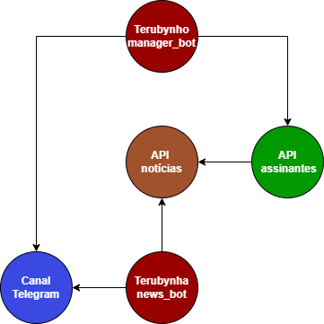

# Telegram Terubytes Newsletter

A Terubytes Newsletter é uma Newsletter diária de com as notícias mais relevantes de tecnologia.

As notícias podem ser recebidas de duas maneiras:

- Canal do Telegram;
- E-mail (atualmente só para gmail);

Para se inscrever, nós temos o bot **Terubynho**, que é responsável por atender os usuários. ele direciona os usuários para o canal do Telegram ou os inscreve para a Newsletter via e-mail. 

# Arquitetura da Aplicação

Nós temos cinco elementos principais para fazer a Newsletter funcionar:

- **Terubynho (manager_bot)**: Cadastra e remove pessoas da Newsletter por email / Dá acesso ao canal do Telegram;
- **Terubynha (news_bot)**: Coleta as notícias e manda no canal do Telegram;
- **Canal Telegram**: Os membros do canal podem discutir cada notícia enviada;
- **API Notícias**: Envia as notícias para a Terubynha e também para a API de assinantes quando requisitado;
- **API Assinantes**: Responsável por armazenar todos os assinantes da Newsletter, coletar as notícias e enviar os e-mails para todos diariamente.riamente.

Veja abaixo figura que representa esta estrutura:



# Tecnologias Utilizadas
Para o projeto num geral:
```
ruby 3.1.1p18
```

Para a API de assinantes:
```
Rails 7.0.4.2
```

Gem para coletar as notícias:
```
news-api 0.2.0
```

Gem para manipular bots do telegram:
```
telegram-bot-ruby 0.23.0
```

Para envio dos emails:
```
Action Mailer 7.0.4.2
```

Gem para programar o envio dos emails:
```
wheneverize 1.0.0
```

Gem para fazer requisições http a API de assinantes:
```
rest-client 2.1.0
```

# Executando a aplicação
Após toda a configuração do ambiente (gerar token para os bots, criar um email e senha de app para enviar os emails), execute os seguintes scripts na pasta raiz:

Para instalar as dependências:
```
$ ./dependencies.sh
```

Para ativar o job que envia os e-mails diariamente:
```
$ ./job.sh 
```

Para rodar os bots e o backend de assinantes:
**OBS: não feche o terminal para conseguir matar o processo. Execute o comando com o "." no começo para o script ser executado no mesmo shell.**
```
$ . ./run.sh
```

# Finalizando a aplicação

Para encerrar os bots e o backend de assinantes:
**OBS: Execute este comando no mesmo terminal que foi usado para rodá-los.**
```
$ . ./stop.sh
```

Para encerrar o job de enviar emails:
```
$ ./clearjob.sh
```
